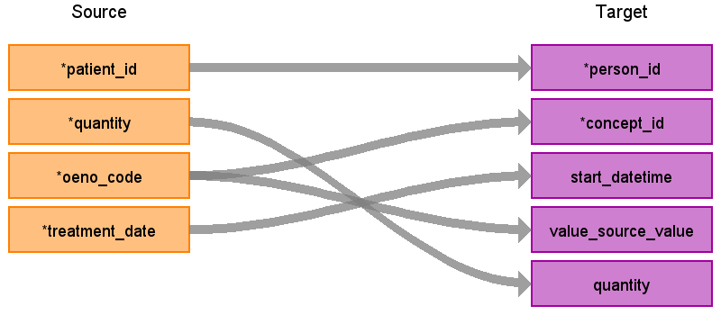

# CDM Table name: EVENT_COMBINED

## Reading from UDMEDSOL.treatment

The `EVENT_COMBINED` (`STEM`) table is a staging area where UDMEDSOL source codes like Procedure codes will first be mapped to concept_ids. The `STEM` table itself is an amalgamation of the OMOP event tables to facilitate record movement. This means that all fields present across the OMOP event tables are present in the `STEM` table. After a record is mapped and staged, the domain of the concept_id dictates which OMOP table (Condition_occurrence, Drug_exposure, Procedure_occurrence, Measurement, Observation, Device_exposure) the record will move to.

Filters out records where `treatment_date` falls after the last recorded `admittance_date` in the source `medical_case` table. This ensures that no treatments outside the export period are included in the output.

|        Destination Field      |         Source field        | Logic | Comment field |
|:-----------------------------:|:---------------------------:|:-----:|:-------------:|
| id                            |                             | `GENERATED ALWAYS AS IDENTITY` | |
| person_id                     | patient_id                  | JOIN visit_detail table ON treatment.case_id = visit_detail.visit_id_source_value | |
| concept_id                    | oeno_code                   | `COALESCE(concept_id, 0)`, LEFT JOIN oeno_mappings table ON treatment.oeno_code = oeno_mappings.source_code | |
| type_concept_id               |                             | Use 32817 - EHR | |
| start_datetime                | treatment_date              | treatment_date IF YEAR(treatment_date) BETWEEN 2000 AND CURRENT YEAR, ELSE visit_detail_start_datetime | |
| end_datetime                  |                             |       | |
| visit_occurrence_id           | visit_occurrence_id         | FROM visit_detail | |
| visit_detail_id               | visit_detail_id             | FROM visit_detail | |
| provider_id                   |                             |       | |
| source_value                  |                             |       | |
| source_concept_id             |                             |       | |
| quantity                      | quantity                    |       | |
| unit_concept_id               |                             |       | |
| unit_source_value             |                             |       | |
| unit_source_concept_id        |                             |       | |
| value_as_number               |                             |       | |
| value_as_concept_id           |                             |       | |
| value_as_string               |                             |       | |
| specimen_source_id            |                             |       | |
| anatomic_site_concept_id      |                             |       | |
| anatomic_site_source_value    |                             |       | |
| disease_status_concept_id     |                             |       | |
| disease_status_source_value   |                             |       | |
| modifier_concept_id           |                             |       | |
| modifier_source_value         |                             |       | |
| verbatim_end_date             |                             |       | |
| stop_reason                   |                             |       | |
| refills                       |                             |       | |
| days_supply                   |                             |       | |
| sig                           |                             |       | |
| route_concept_id              |                             |       | |
| route_source_value            |                             |       | |
| lot_number                    |                             |       | |
| unique_device_id              |                             |       | |
| production_id                 |                             |       | |
| condition_status_concept_id   |                             |       | |
| condition_status_source_value |                             |       | |
| operator_concept_id           |                             |       | |
| value_source_value            | oeno_code                   |       | |
| range_low                     |                             |       | |
| range_high                    |                             |       | |
| qualifier_concept_id          |                             |       | |
| qualifier_source_value        |                             |       | |
| reference_field_concept_id    |                             |       | |
| reference_event_id            |                             |       | |
| event_time                    |                             |       | |
| domain                        | bno_mappings.concept_domain |       | |
| default_domain                |                             | 'Procedure' | |
| amount_allowed                |                             |       | |
| cost_type_concept_id          |                             |       | |
| currency_concept_id           |                             |       | |
| drg_concept_id                |                             |       | |
| drg_source_value              |                             |       | |
| paid_by_patient               |                             |       | |
| paid_by_payer                 |                             |       | |
| paid_by_primary               |                             |       | |
| paid_dispensing_fee           |                             |       | |
| paid_ingredient_cost          |                             |       | |
| paid_patient_coinsurance      |                             |       | |
| paid_patient_copay            |                             |       | |
| paid_patient_deductible       |                             |       | |
| payer_plan_period_id          |                             |       | |
| revenue_code_concept_id       |                             |       | |
| revenue_code_source_value     |                             |       | |
| total_charge                  |                             |       | |
| total_cost                    |                             |       | |
| total_paid                    |                             |       | |
| visit_occurrence_source_value |                             |       | |
| source_table                  |                             | 'treatment' | |
| source_table_pk               |                             |       | |

## Change log
