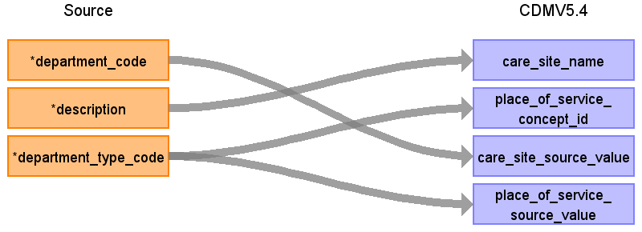

# CDM Table name: CARE_SITE

## Reading from UDMEDSOL.department_info

|        Destination Field      |     Source field     | Logic | Comment field |
|:-----------------------------:|:--------------------:|:--------:| |
| care_site_id                  |                      | `GENERATED ALWAYS AS IDENTITY` | |
| care_site_name                | description          | DISTINCT description | |
| place_of_service_concept_id   | department_type_code | Map: 'O' → 9202; ('I', C') → 9201; ELSE → 0 | |
| location_id                   | location.location_id | | |
| care_site_source_value        | department_code      | | |
| place_of_service_source_value | department_type_code | | |

## Change log
