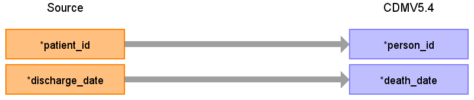

# CDM Table name: DEATH

## Reading from UDMEDSOL.medical_case

Filters records to only those where the patient died (`discharge_type = '4'`) and has a recorded `discharge_date`. This ensures that only valid, completed death cases are included.

|        Destination Field      |     Source field     | Logic | Comment field |
|:-----------------------------:|:--------------------:|:--------:| |
| person_id                     | patient_id           | JOIN person table ON person.person_source_value = medical_case.patient_id | |
| death_date                    | discharge_date       | `MIN()` | |
| death_datetime                |                      | | |
| death_type_concept_id         |                      | Use 32817 - EHR | |
| cause_of_death_concept_id     |                      | | |
| cause_of_death_source_value   |                      | | |
| cause_source_concept_id       |                      | | |

## Change log
