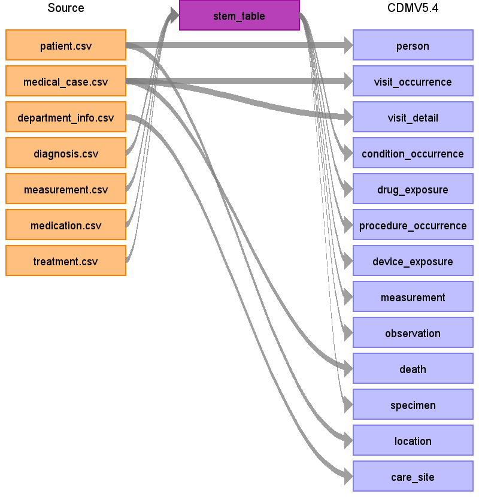

# University of Debrecen Clinical Database ETL Documentation

This guide documents the conversion process of University of Debrecen data into the [OMOP Common Data Model](https://ohdsi.github.io/CommonDataModel/).

