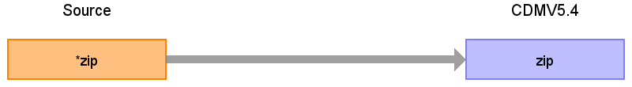

# CDM Table name: LOCATION

## Reading from UDMEDSOL.patient

|        Destination Field      |     Source field     | Logic | Comment field |
|:-----------------------------:|:--------------------:|:--------:| |
| location_id                   |                      | `GENERATED ALWAYS AS IDENTITY` | |
| address_1                     |                      | | |
| address_2                     |                      | | |
| city                          |                      | | |
| state                         |                      | | |
| zip                           | zip                  | DISTINCT zip | |
| county                        |                      | | |
| location_source_value         |                      | | |
| country_source_value          |                      | 'HUN' | |

## Change log
