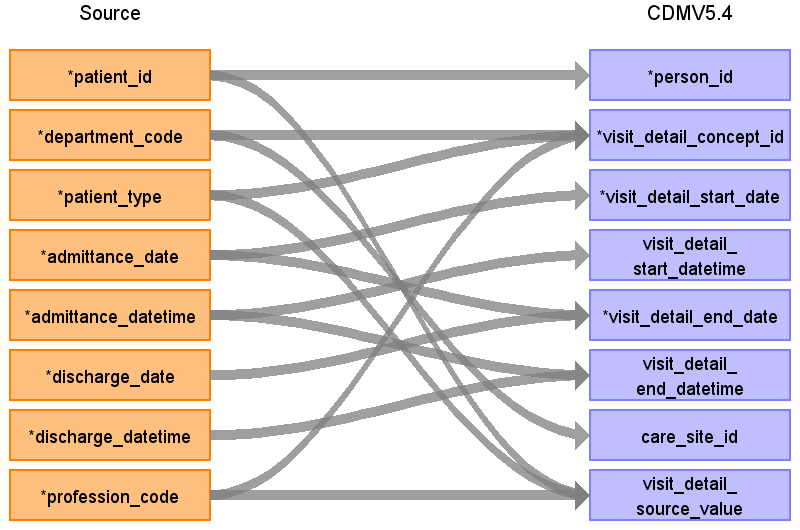

# CDM Table name: VISIT_DETAIL

## Reading from UDMEDSOL.medical_case

Take all records from UDMEDSOL table `medical_case`. 

Maps each record to a visit type (`case_type`) concept based on `profession_code`, `department_code`, and `patient_type` using the following priority order:
- Emergency visits are identified first via `profession_code LIKE '46%'`, then split into inpatient (`ERIP`) or non-inpatient (`ER`) based on `patient_type`.
- Intensive care (`INT`) is detected either by specific profession codes or department codes. The department codes listed are not currently present in the source data.
- Remaining records fall through to general inpatient (`IP`), cure (`CURE`), or outpatient (`OP`) classification based solely on `patient_type`.

Joins to the visit_occurrence table on `person_id` and `admittance_datetime` to associate each record with its corresponding visit. For inpatient records (`patient_type = 'I'`), 1 second is added to `admittance_datetime` before the `BETWEEN` check. This handles cases where `admittance_datetime` and `discharge_datetime` are identical — without this adjustment, the timestamp would not fall within the visit window and the join would fail to match.

|        Destination Field       |     Source field     | Logic | Comment field |
|:------------------------------:|:--------------------:|:--------:| |
| visit_detail_id                |                      | `GENERATED ALWAYS AS IDENTITY` | |
| person_id                      | patient_id           | JOIN person table ON person.person_source_value = medical_case.patient_id | |
| visit_detail_concept_id        | department_code, patient_type, profession_code | Map: 'IP' → 9201; 'OP' → 9202; 'CURE' → 8756; 'ERIP' → 262; 'ER' → 9203; 'INT' → 32037; ELSE → 0 | |
| visit_detail_start_date        | admittance_date      | | |
| visit_detail_start_datetime    | admittance_datetime  | | |
| visit_detail_end_date          | discharge_date       | `admittance_date` is used for outpatients (`patient_type = 'O'`) | |
| visit_detail_end_datetime      | discharge_datetime   | `admittance_datetime` is used for outpatients (`patient_type = 'O'`) | |
| visit_detail_type_concept_id   |                      | Use 32817 - EHR | |
| provider_id                    |                      | | |
| care_site_id                   | care_site_id         | care_site_id from visit_occurrence table | |
| visit_detail_source_value      | department_code, patient_type, profession_code | | |
| visit_detail_source_concept_id |                      | | |
| admitting_source_concept_id    |                      | | |
| admitting_source_value         |                      | | |
| discharge_to_concept_id        |                      | | |
| discharge_to_source_value      |                      | | |
| preceding_visit_detail_id      |                      | | |
| visit_detail_parent_id         |                      | | |
| visit_occurrence_id            | visit_occurrence_id  | JOIN person table ON person_id AND visit_start and visit_end datatimes | |
| visit_id_source_value          | case_id              | | |

## Change log
